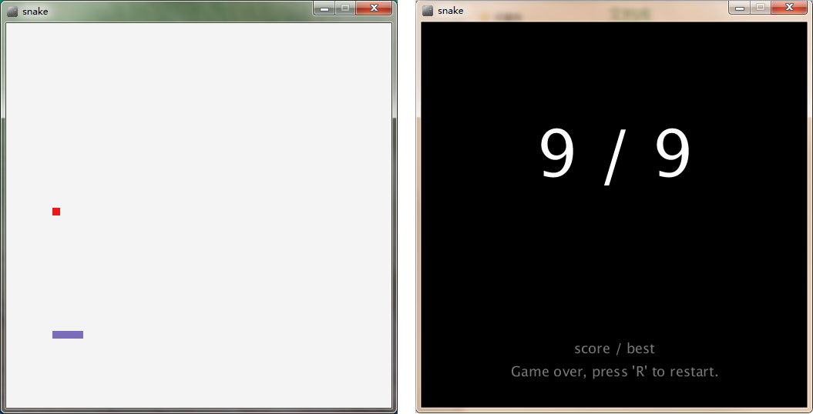

# processing-snake
snake game by processing

### 缘由

几年前写过DOM版本的贪吃蛇，这次使用 [processing](https://processing.org/) 来写，
又是另外一种感觉。很棒，很不错！

再加上 [processing-js](https://github.com/jeresig/processing-js) 的支持，使得pde文件可以运行在web上，编译成 js 代码在 canvas 上运行。

### 说明
1. 试玩地址：http://paper.github.io/processing-snake/snake.html
2. 自己设计制作了一个 favicon，试玩的时候，可以看到
3. chrome 本地运行不了的童鞋看这里：https://github.com/jeresig/processing-js#loading-processingjs-sketches-locally
